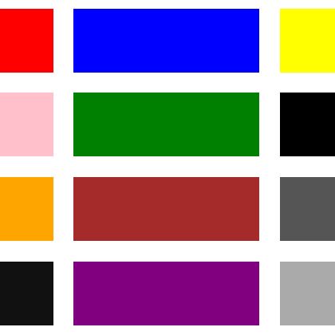

# Simple Grid

<kbd></kbd>

A very simple grid system. No bells or whistles. Just a responsive grid in under 30 lines of CSS.

* Breakpoints for mobile, tablet, and desktop
* Option to choose 3 or 4 columns max for wider screens
* Works whether or not grid elements have borders

### To Use

* For either CSS or SASS, copy the content of the app/styles/main.scss file into your own .css or .scss file and use the class names in your code as desired

Check out a live example [here](http://simplegrid-danbuda.surge.sh/) or a working CodePenn [here](http://codepen.io/danbuda/pen/KgVgxz).
